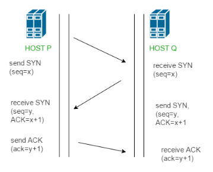

## **1. TCP vs UDP – Understanding Transport Protocols**

Both **TCP** and **UDP** operate at the **Transport Layer** of the TCP/IP model. They help deliver data between devices (like your phone to a web server), but in **very different ways**.

| Feature         | TCP (Transmission Control Protocol)  | UDP (User Datagram Protocol)   |
| --------------- | ------------------------------------ | ------------------------------ |
| Type            | Connection-oriented                  | Connectionless                 |
| Reliability     | Ensures delivery (ACKs, retries)     | No guarantee of delivery       |
| Speed           | Slower (due to checks)               | Faster                         |
| Use Case        | Web browsing, emails, file transfers | Streaming, games, DNS, VoIP    |
| Packet Handling | Ordered and complete                 | May be out of order or dropped |
| Overhead        | High                                 | Low                            |

---

### ✅ Beginner Analogy:

* **TCP** is like a **phone call**: you say “hello,” they reply “hello,” and you take turns talking — reliable and confirmed.
* **UDP** is like **sending letters**: you post them quickly without knowing if they arrived or not.

<div align="center">
  
</div>

---

## **2. IP Address (IPv4 and IPv6)**

### 📌 What is an IP Address?

An **IP address** is a **unique number** assigned to each device on a network so it can **send/receive data**.

---

### ✅ Types of IP Addresses:

| Type | Format             | Example        | Total Addresses          |
| ---- | ------------------ | -------------- | ------------------------ |
| IPv4 | 32-bit (4 blocks)  | `192.168.1.1`  | \~4.3 billion addresses  |
| IPv6 | 128-bit (8 groups) | `2001:0db8::1` | 340 undecillion (a lot!) |

---

### Why IPv6?

IPv4 is running out! IPv6 was created to provide **more addresses**, better **security**, and **faster routing**.

<div align="center">
  
</div>

---

## **3. Ports – How One IP Talks to Many Apps**

### ✅ What is a Port?

Think of an IP address like a **building address**, and a **port** as the **apartment number** inside it.

A device uses one IP, but it can **run many apps/services**. Ports help distinguish them.

---

### Common Port Numbers:

| Port | Protocol | Use                    |
| ---- | -------- | ---------------------- |
| 80   | HTTP     | Web traffic            |
| 443  | HTTPS    | Secure web traffic     |
| 22   | SSH      | Remote login (Linux)   |
| 25   | SMTP     | Sending emails         |
| 53   | DNS      | Domain name resolution |
| 3306 | MySQL    | Database               |

<div align="center">
  
</div>
---

## **4. MAC Address – The Unique ID of Every Device**

### ✅ What is a MAC Address?

A **MAC (Media Access Control) Address** is a **hardware ID** given to every network device (like your laptop or router’s network card).

* It’s permanent and unique like a **serial number**.
* Format: `00:1A:2B:3C:4D:5E` (6 groups of hexadecimal digits)

### 🔄 Difference: IP vs MAC

| Feature       | IP Address        | MAC Address            |
| ------------- | ----------------- | ---------------------- |
| Changes often | Yes (can change)  | No (fixed to hardware) |
| Used by       | Routers, Internet | Local network switches |
| Example       | `192.168.0.10`    | `00:1C:42:2B:60:5A`    |

<div align="center">
  
</div>
---

### 📡 MAC Address Types – Unicast, Broadcast, Multicast

| Type      | Meaning                                  | Example Address             |
| --------- | ---------------------------------------- | --------------------------- |
| Unicast   | Sent to **one specific device**          | `00:1A:2B:3C:4D:5E`         |
| Broadcast | Sent to **all devices** on local network | `FF:FF:FF:FF:FF:FF`         |
| Multicast | Sent to **a group** of devices           | `01:00:5E:xx:xx:xx` (range) |

---

### ✅ Beginner Explanation:

* **Unicast**: Like calling your friend’s phone number.
* **Broadcast**: Like yelling in a room – everyone hears.
* **Multicast**: Like a Zoom call – only invited people join and listen.

---

### 🔶 6. ARP (Address Resolution Protocol)

#### ❓ What is ARP?

When a device wants to send data to another device **in the same network**, it needs the **MAC address** of that device.
But usually, it only knows the **IP address**. So ARP helps map **IP → MAC**.

#### 🛠️ How ARP Works (Step-by-step):

Imagine your PC (192.168.1.10) wants to send data to Printer (192.168.1.20):

1. Your PC creates a packet with destination IP: `192.168.1.20`.
2. It checks its **ARP cache** – does it know the MAC for this IP?
3. If not, it broadcasts an **ARP Request**:

   > "Who has IP 192.168.1.20? Tell me your MAC."
4. The Printer replies with:

   > "I have that IP, my MAC is `AA:BB:CC:DD:EE:FF`."
5. Your PC stores it in the cache and sends the data to that MAC.

<div align="center">
  
</div>
---

### 🔶 RARP (Reverse ARP)

#### ❓ What is RARP?

The reverse of ARP. It maps **MAC → IP**.
Used when a diskless computer (no OS yet) knows its **MAC** but needs to find its **IP address** from a RARP server.

> 🔄 Today, RARP is mostly replaced by **DHCP**.

---

### 🔶 7. ICMP (Internet Control Message Protocol)

#### ❓ What is ICMP?

It’s used **not to transfer data**, but to **send control and error messages** between devices.

#### 📌 Real-Life Use: `ping` command.

When you type:

```bash
ping google.com
```

You’re sending an ICMP **Echo Request**, and you get back an **Echo Reply**.

#### 🔄 Other ICMP Uses:

* "Destination Unreachable"
* "Time Exceeded" (used in `traceroute`)

> ICMP works at **Network Layer** (Layer 3).

---

### 🔷 POP3 (Post Office Protocol v3)

#### ❓ What is POP3?

POP3 is a **mail-receiving protocol**. It lets your email client download mail from a mail server and usually **deletes it from the server** after downloading.

#### 💡 Real-life analogy:

It’s like going to the post office, picking up all your letters, and taking them home — then they’re no longer in the post office.

#### 📌 POP3 Default Port:

* TCP **Port 110**

> ⚠️ POP3 is old. IMAP is more modern and preferred.

---

### 🔶 8. HTTP / HTTPS

#### ❓ What is HTTP?

**HyperText Transfer Protocol** – It’s the foundation of data communication for the **World Wide Web**.
When you open a website, your browser sends an **HTTP request**, and the server responds with a **web page** (HTML, CSS, images, etc.).

#### 📌 How HTTP Works (Basic Steps):

1. Browser sends a **GET request** to the server.
2. Server responds with the **HTML page**.
3. Browser renders it for you.

#### ❗ HTTP is insecure – all data is plain text.

---

#### 🔒 What is HTTPS?

**HTTP + SSL/TLS** = Secure HTTP
All data is **encrypted**, so no one can eavesdrop.

#### 📌 Ports:

* HTTP: **Port 80**
* HTTPS: **Port 443**

#### 🔐 Real-Life Use:

* Online banking
* Gmail
* Any login form

<div align="center">
  
</div>

---

### 🔶 9. SMTP (Simple Mail Transfer Protocol)

#### ❓ What is SMTP?

SMTP is used for **sending** emails from your client (like Outlook or Gmail) to a mail server or between servers.

* It is **push-based**: It pushes mail **from sender to recipient's mail server**.

#### 📌 SMTP Default Port:

* TCP **Port 25** (Plain)
* **Port 587** (with STARTTLS for encryption)

#### 📌 Flow of Email (Simplified):

1. You send email using SMTP → goes to your mail server.
2. That server finds the recipient’s mail server → sends the mail using SMTP.
3. The receiver downloads it using **POP3 or IMAP**.

<div align="center">
  
</div>

---

### 🔷 FTP (File Transfer Protocol)

#### ❓ What is FTP?

A standard protocol used to **transfer files** between computers over a network.

#### 📌 How It Works:

* You connect to an FTP server.
* You can upload (put) or download (get) files.
* It uses **two ports**:

  * **Port 21** – control (commands)
  * **Port 20** – data (files)

#### 🔐 Problem:

* FTP transmits **data in plain text** (even passwords).

> 🔒 Secure versions:

* **FTPS** (FTP Secure – uses TLS)
* **SFTP** (SSH File Transfer Protocol – completely different, but secure)

---

### 🧠 Summary Table:

| Protocol | Purpose                  | Port   | Secure?   |
| -------- | ------------------------ | ------ | --------- |
| ARP      | Resolve IP to MAC        | N/A    | No        |
| RARP     | Resolve MAC to IP        | N/A    | No        |
| ICMP     | Control & error messages | N/A    | No        |
| POP3     | Receive emails           | 110    | No        |
| SMTP     | Send emails              | 25/587 | Yes (587) |
| HTTP     | Web browsing             | 80     | No        |
| HTTPS    | Secure web browsing      | 443    | Yes       |
| FTP      | Transfer files           | 21/20  | No        |
| SFTP     | Secure file transfer     | 22     | Yes       |

---
