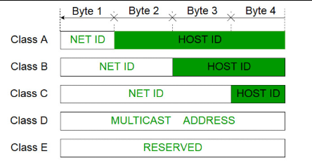
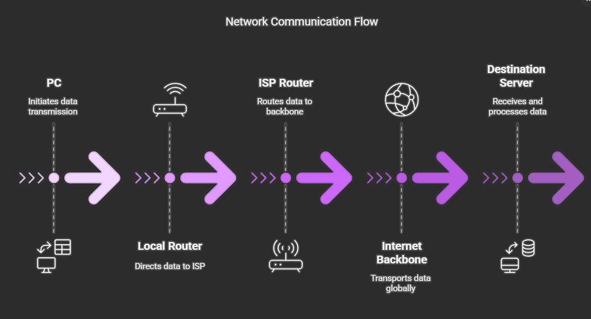
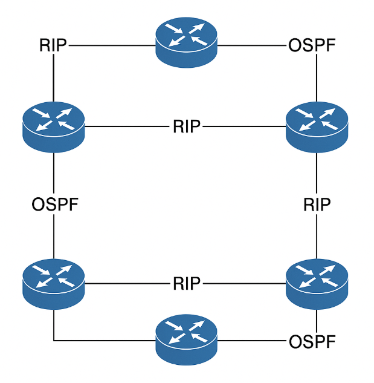
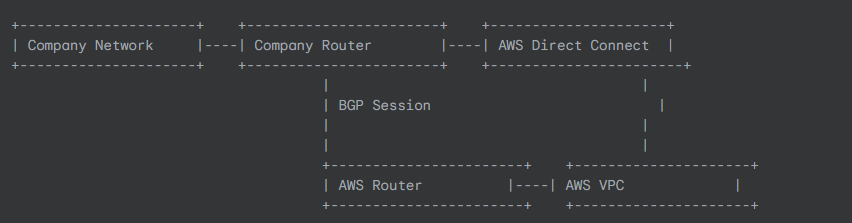
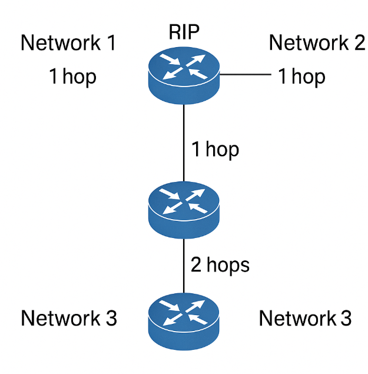

# 🧠 Master IP Management – Beginner to Advanced

## 🔹 Part 1: **Classful Addressing** (The Original IP Addressing System)

### ✅ What is an IP Address?

An **IP address** is like the **address of a house** on the Internet. Just as your home needs a postal address to receive mail, your computer (or any device) needs an IP address to send/receive data on a network.

An IPv4 address looks like:
`192.168.1.1` — This is a 32-bit number (4 parts, called octets)

Each part (e.g., 192, 168) is an **8-bit number**, ranging from 0 to 255.

---

### 🏠 Network vs Host

* **Network portion**: Identifies which network this IP belongs to
* **Host portion**: Identifies a unique device (host) inside that network

---

### ✅ What is Classful Addressing?

Before modern techniques, IP addresses were divided into fixed "classes":

| Class | Starting Bits | Range                        | Subnet Mask         | Hosts per Network | Used For          |
| ----- | ------------- | ---------------------------- | ------------------- | ----------------- | ----------------- |
| A     | 0xxxxxxx      | 1.0.0.0 to 126.255.255.255   | 255.0.0.0 (/8)      | \~16 million      | Very large orgs   |
| B     | 10xxxxxx      | 128.0.0.0 to 191.255.255.255 | 255.255.0.0 (/16)   | \~65,000          | Medium orgs       |
| C     | 110xxxxx      | 192.0.0.0 to 223.255.255.255 | 255.255.255.0 (/24) | 254               | Small networks    |
| D     | 1110xxxx      | 224.0.0.0 to 239.255.255.255 | —                   | —                 | Multicast         |
| E     | 1111xxxx      | 240.0.0.0 to 255.255.255.255 | —                   | —                 | Reserved/Research |

### 🔧 Real-Life Analogy:

Think of class A as a **university**, class B as a **city**, and class C as a **building**. Each contains many "rooms" (host addresses).

---


---

### 🧨 Limitations of Classful Addressing:

* Wastes IP addresses (e.g., even if you need 1000 IPs, you get 65K in Class B)
* Can’t handle flexible network sizes

---

## 🔹 Part 2: **CIDR Notation** (Classless Inter-Domain Routing)

### ✅ What is CIDR?

CIDR solves classful addressing problems by allowing **custom division** of network and host portions.

### ✍️ Format:

```
IP address / prefix length
Example: 192.168.1.0/24
```

Here:

* **/24** = First 24 bits are for the network
* That leaves **8 bits** for hosts → 2^8 = 256 addresses (254 usable)

---

### ✅ Why Use CIDR?

* **More efficient use of IP space**
* **Custom subnet sizes**
* Enables **VPC designs in cloud platforms (AWS, Azure)**

### 🧠 Key Prefix Lengths

| CIDR | Subnet Mask     | Hosts (Usable) |
| ---- | --------------- | -------------- |
| /8   | 255.0.0.0       | \~16 million   |
| /16  | 255.255.0.0     | \~65,000       |
| /24  | 255.255.255.0   | 254            |
| /30  | 255.255.255.252 | 2              |

---

## 🔹 Part 3: **Subnetting** (Breaking Networks Into Smaller Pieces)

### ✅ What is Subnetting?

Subnetting is **dividing one big network into smaller, manageable chunks**.

Think of it as taking a large apartment building (network) and separating it into **floors or wings** (subnets) to isolate departments, apps, or security zones.

---

### 🎯 Why Subnet?

* **Improve security** (e.g., isolate DB subnet)
* **Efficient IP use**
* **Reduce broadcast traffic**
* **Align with cloud design patterns** (like AWS VPCs)

---

### ✅ How Subnetting Works

Let’s say we have this network:

```
192.168.1.0/24 → 254 usable IPs
```

But we want **4 departments**, each with 62 usable IPs.

We break `/24` into four **/26** subnets:

| Subnet # | Network Address  | First IP      | Last IP       | Broadcast Address |
| -------- | ---------------- | ------------- | ------------- | ----------------- |
| 1        | 192.168.1.0/26   | 192.168.1.1   | 192.168.1.62  | 192.168.1.63      |
| 2        | 192.168.1.64/26  | 192.168.1.65  | 192.168.1.126 | 192.168.1.127     |
| 3        | 192.168.1.128/26 | 192.168.1.129 | 192.168.1.190 | 192.168.1.191     |
| 4        | 192.168.1.192/26 | 192.168.1.193 | 192.168.1.254 | 192.168.1.255     |

---

## 🔹 Part 4: **Subnets** – The Building Blocks

### ✅ What is a Subnet?

A **subnet** is a portion of a network created by **subnetting**.

Each subnet contains:

* **Network Address**: first address in the block (e.g., `192.168.1.0`)
* **Broadcast Address**: last address (e.g., `192.168.1.255`)
* **Usable IPs**: All the ones between

---

### 🧮 Quick Calculation Formula

If you want to calculate how many IPs a subnet has:

```
Number of IPs = 2^(32 - CIDR Prefix)
Usable IPs = Total - 2 (network + broadcast)
```

### Example:

* `/26` → 2^(32-26) = 64 IPs → 62 usable
* `/30` → 4 IPs → 2 usable (used in router links)

---

### 🧩 In DevOps & Cloud:

* You assign **subnets for different workloads**: frontend, backend, DB, monitoring
* You build **routing tables between subnets**
* You isolate traffic using **NACLs or security groups**

---
## 🔹 5. **How CIDR Makes Subnetting Easier**

---

### ✅ Recap: What Is CIDR?

**CIDR (Classless Inter-Domain Routing)** lets us break the rigid Class A/B/C structure and customize networks based on our **actual IP needs**, not some fixed block.

Format: `IP_address/prefix`
Example: `192.168.0.0/22`

---

### ✅ Why It Makes Subnetting Easier:

| Old Classful                 | CIDR Approach                              |
| ---------------------------- | ------------------------------------------ |
| Limited to 3 sizes (A, B, C) | Customize any size                         |
| Wastes IPs                   | Efficient use of IPs                       |
| Less flexibility in networks | Tailor subnets per department/service/load |

---

### 🧠 CIDR Benefits in DevOps:

* Create **subnets of exact size** in cloud environments (e.g., AWS VPCs)
* Scale **networks without redesign**
* Helps define **routing boundaries** in infrastructure as code

---

## 🔹 6. **Routing Basics** (How Packets Travel from A to B)

---

### 🧭 What Is Routing?

Routing is like **Google Maps for data**. It finds the best way for packets (small chunks of data) to travel from one IP address to another.

If you're accessing a website in the U.S. from India:

* Your packet goes from **your PC → router → ISP → multiple routers → target server**
* Each device uses **routing tables** to decide where to send it next

---

### ✅ Key Concepts:

| Term                | Meaning                                             |
| ------------------- | --------------------------------------------------- |
| **Router**          | Device that forwards packets to other networks      |
| **Hop**             | Each time a packet jumps from one router to another |
| **Routing Table**   | A list of known networks and how to reach them      |
| **Default Gateway** | The first router your computer sends packets to     |

---

### 🚦 How Routing Works:

1. Your computer wants to reach `10.0.2.15`.
2. It checks if it’s in the same subnet.
3. If not, it sends the packet to the **gateway/router**.
4. That router checks its routing table.
5. The packet keeps hopping until it reaches the destination.

---



---

## 🔹 7. **Routing Protocols**

---

### ✅ What Are Routing Protocols?

These are **rules used by routers** to talk to each other and **share network paths**.

There are two major categories:

---

### 📍 A. **IGP – Interior Gateway Protocols**

(Used inside one organization)

| Protocol | Type            | Description                               |
| -------- | --------------- | ----------------------------------------- |
| RIP      | Distance Vector | Simple, uses hop count, slow              |
| OSPF     | Link State      | Faster, efficient, used in large networks |
| EIGRP    | Hybrid          | Cisco proprietary, combines both          |

---

### 📍 B. **EGP – Exterior Gateway Protocols**

(Used between organizations, e.g., ISPs)

| Protocol | Type        | Description                             |
| -------- | ----------- | --------------------------------------- |
| BGP      | Path Vector | Backbone of the Internet, very scalable |

---

### 🚀 DevOps & Cloud Relevance:

* You use **static routes** inside cloud VPCs.
* **BGP** is used for AWS Direct Connect, Azure ExpressRoute.
* **OSPF**/RIP helps with **automated failover and scaling**.

---



---

## 🔹 8. **Routing Algorithms: Distance Vector vs Link State**

---

Routing protocols use **algorithms** to decide the best path. Two main types:

---

### 📘 A. Distance Vector Algorithm (e.g., RIP)

* **Sends its entire routing table** to neighbors every 30 seconds.
* Measures cost based on **hop count** (fewer hops = better path).
* Simple but **slow to converge** (takes time to recover from failure).

> 🔍 Think of it like:
> You ask all your friends how to reach a restaurant and everyone only tells you how many turns it takes, **not the quality or traffic** on the route.

---

### 📗 B. Link State Algorithm (e.g., OSPF)

* Every router **builds a full map** of the network using **LSAs (Link-State Advertisements)**.
* Calculates best path using **Dijkstra’s Algorithm**.
* **Faster, more efficient**, reacts quickly to changes.

> 🔍 Think of it like:
> You have Google Maps. It shows you the entire road network and lets you choose the fastest route based on **real-time traffic**.

---

### 🔍 Comparison Table:

| Feature           | Distance Vector     | Link State           |
| ----------------- | ------------------- | -------------------- |
| Protocol Example  | RIP                 | OSPF                 |
| Metric Used       | Hop count           | Bandwidth, cost      |
| Info Shared       | Whole routing table | Only network changes |
| Convergence Speed | Slow                | Fast                 |
| Scalability       | Limited             | Highly scalable      |

---



---
