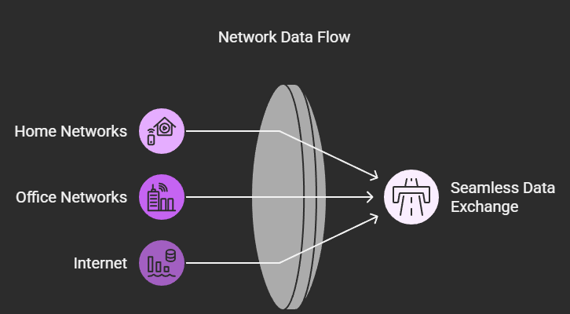
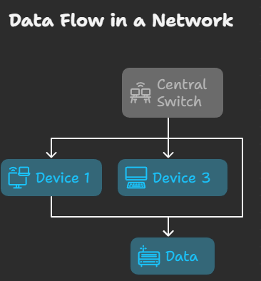
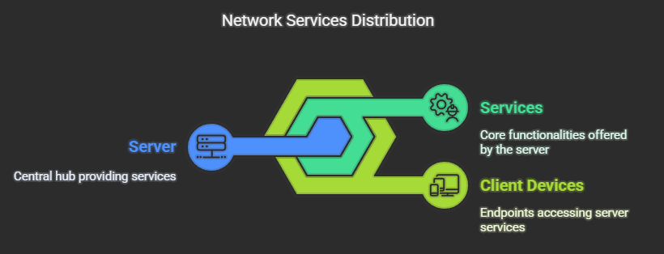
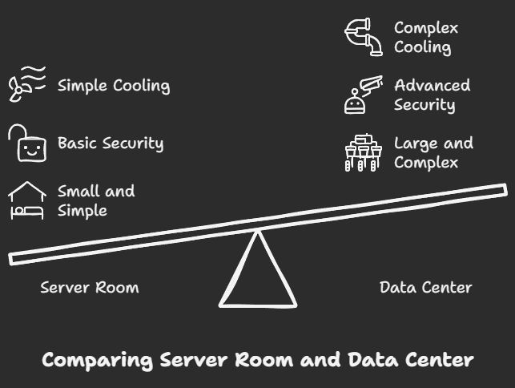
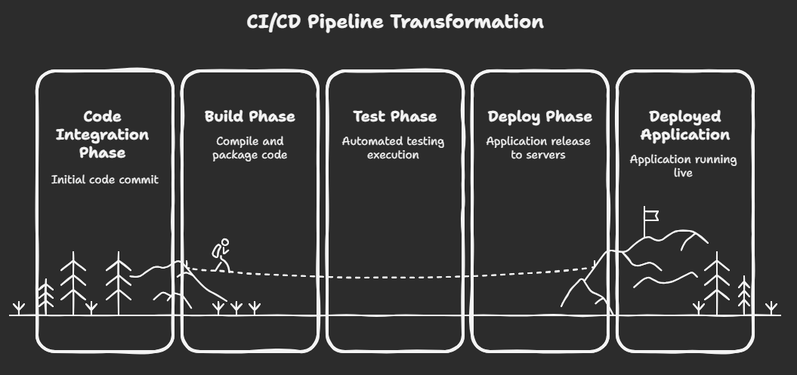
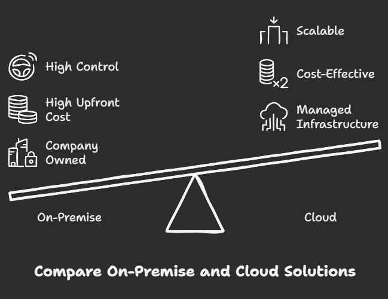

## 1. Router

* **What it is:** Think of a router as a traffic director for data. In your home, your router connects your devices (laptops, phones) to the internet. In a larger network, like a company's, routers manage the flow of data between different networks.

* **How it works:** Data travels in packets, like letters. Each packet has an address (IP address) on it. The router reads this address and determines the best path to send the packet towards its destination. It does this by using a routing table, which is a map of the network.

* **Analogy**: A router is like a postal service sorting office. It receives mail (data packets), reads the address, and sends it on the correct path towards its destination.

  

## 2. Switches

* **What it is:** A switch is like a router, but it works on a smaller scale, within a single network. If a router directs traffic *between* networks, a switch directs traffic *within* a network (like your home network or an office's local network).

* **How it works:** A switch connects multiple devices (computers, servers, printers) within the same network. When a device sends data to another device on the same network, the switch makes sure that the data goes only to the intended recipient, not to everyone else. It does this by using MAC addresses, which are unique identifiers for network interfaces.

* **Analogy:** A switch is like an office receptionist. When a visitor (data) arrives for a specific person (device), the receptionist directs them only to that person's office, not to everyone in the building.

## 3. Server

* **What it is:** A server is a specialized computer designed to provide services to other computers (clients). It's like a waiter in a restaurant; it takes requests and delivers.

* **Examples of Services:**

    * Hosting websites: A web server stores the files of a website and sends them to your browser when you visit a site.

    * Storing files: A file server stores files that can be accessed by multiple users.

    * Sending emails: An email server handles sending and receiving emails.

    * Running applications: Application servers provide the environment to run software applications.

* **Hardware:** Servers are often more powerful than regular desktop computers, with more memory, storage, and faster processors. However, a regular computer *can* act as a server, though it might not be as efficient for heavy workloads.

* **Operating System**: Servers often run specialized operating systems (like Windows Server, Linux distributions like Red Hat, Ubuntu Server) that are optimized for server tasks.

## 4. Server Room vs. Data Center

* **Server Room:** A server room is a dedicated space within a building (like an office) that houses servers and related equipment.

    * It might contain a few to dozens of servers.

    * It usually has controlled temperature and humidity to prevent equipment overheating.

    * It may have basic security measures.

* **Data Center:** A data center is a much larger, specialized facility designed to house a large number of servers and networking equipment.

    * It can contain hundreds or thousands of servers.

    * It has sophisticated cooling systems, redundant power supplies (to prevent downtime), and advanced security measures (biometrics, surveillance).

    * Data centers are built for high availability, meaning they are designed to keep services running even if some hardware fails.

* **Key Difference**: Scale and purpose. A server room serves the needs of a single organization within a building. A data center provides services to many organizations, often over the internet.

## 5. What is a Data Center?

* As explained above, a data center is a specialized facility that houses the computer systems and associated components, such as telecommunications and storage systems, that power the internet and many of the services we use daily.

* **Components**:

    * Servers: The core of the data center, providing computing power.

    * Network equipment (routers, switches): To manage data flow.

    * Storage systems (hard drives, solid-state drives): To store data.

    * Power infrastructure: Redundant power supplies, generators, and batteries to ensure continuous operation.

    * Cooling systems: To prevent equipment from overheating.

    * Security systems: To protect the data and equipment.

* **Importance**: Data centers are the backbone of the digital world. They support:

    * Websites and online applications

    * Cloud computing services

    * E-commerce

    * Social media

    * Financial transactions

    * And much more

## 6. How Servers Play a Major Role in DevOps

* **DevOps** is a set of practices that combines software development (Dev) and IT operations (Ops) to shorten the systems development life cycle and provide continuous delivery with high software quality.

* **Servers in DevOps**: Servers are fundamental to DevOps in many ways:

    * **Infrastructure**: Servers \*are\* the infrastructure. Whether physical or virtual, they provide the hardware where applications run.

    * **Deployment**: DevOps practices often involve automating the deployment of applications to servers. Tools like Ansible, Puppet, and Chef configure servers and deploy code.

    * **Continuous Integration/Continuous Deployment (CI/CD)**: CI/CD pipelines automate the process of building, testing, and deploying code. Servers host the tools (like Jenkins) that manage these pipelines, and they are the target for the deployed applications.

    * **Monitoring**: Servers host monitoring tools (like Nagios, Prometheus) that track the health and performance of applications and the underlying infrastructure.

    * **Automation**: DevOps emphasizes automation, and servers are the machines that execute the automated tasks.

* **In essence**: DevOps is about streamlining the process of getting software from development to production, and servers are the stage where that production happens.

* **Diagram Suggestion**:

    * *(A diagram showing a CI/CD pipeline (Build -> Test -> Deploy) with arrows. A server icon should be present at the "Deploy" stage, with labels like "Application Server", "Database Server", etc. Tools like Jenkins, Ansible, and monitoring tools should be shown as part of the pipeline.)*

## 7. Why On-Premise Servers Are Used vs. Why Cloud Platforms Are Preferred

* **On-Premise Servers:** These are servers that a company owns and operates within its own physical facilities (the server room we talked about earlier).

    * **Why used:**

        * Data security and compliance: Some organizations with very strict data security or regulatory requirements (e.g., some financial institutions, government agencies) prefer to keep their data and servers under their direct control.

        * Legacy systems: Some older applications may be difficult or expensive to migrate to the cloud.

        * Control: Organizations have full control over the hardware and software.

* **Cloud Platforms:** These are services provided by third-party providers (like Amazon Web Services (AWS), Microsoft Azure, Google Cloud Platform (GCP)) that offer computing resources (servers, storage, etc.) over the internet.

    * **Why preferred:**

        * Scalability: Easily increase or decrease resources as needed, without having to buy and install new hardware.

        * Cost-effectiveness: Pay-as-you-go pricing, which can be cheaper than buying and maintaining your own hardware, especially for startups or companies with fluctuating needs.

        * Flexibility: Access a wide range of services (databases, AI, etc.) on demand.

        * Reliability: Cloud providers have highly redundant infrastructure, ensuring high availability and uptime.

        * Reduced maintenance: The cloud provider handles the maintenance of the hardware and infrastructure.

        * Speed of deployment: Resources can be provisioned very quickly.

* **Trend**: The trend is strongly towards cloud platforms due to the advantages they offer. However, on-premise solutions still have a place for specific use cases. Many companies use a hybrid approach, using both on-premise and cloud resources.

