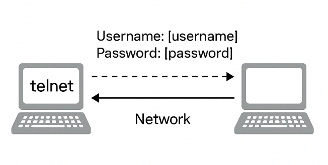
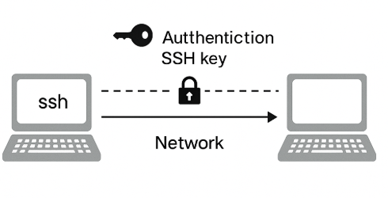
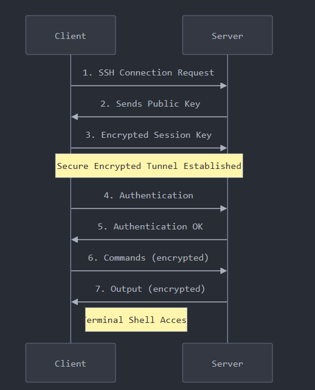
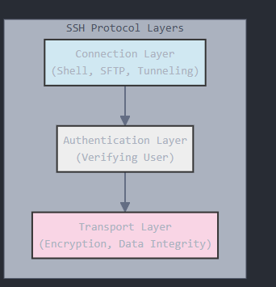
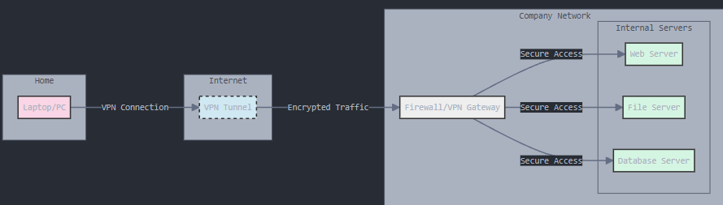

# 👨‍🏫**Secure Remote Communication**

## 🔹 1. **What is Telnet?**

---

### 📖 Definition:

**Telnet (TELecommunication NETwork)** is a **remote command-line protocol** that allows one computer to connect and control another over a TCP/IP network — as if you were sitting at the remote machine.

---

### ⚙️ How It Works:

* You connect to a remote machine using `telnet <IP_address> <port>`.
* Telnet opens a **TCP connection** to port 23 (default).
* You can then run **commands remotely**.

---

### 🔓 Key Point:

* **No encryption** – everything (including your username/password) is sent **as plain text**!
* Anyone sniffing the network can **see your credentials**.
* Only useful for internal, low-security setups.

---

### 🧪 Real-Life Example:

```bash
telnet 192.168.1.100 23
```

If successful, you will get a command prompt of the remote system (like typing on that machine's terminal).

---

### 🧠 DevOps Relevance:

* **Not used in production** anymore due to **security risks**.
* May be found in **legacy network devices** or **lab environments**.

---

<div align="center">
  
</div>

---

## 🔹 2. **What is SSH?**

---

### 📖 Definition:

**SSH (Secure Shell)** is a **secure alternative to Telnet** that allows encrypted communication between two systems. It’s the **standard method** for remote administration of Linux/Unix servers.

---

### ⚙️ How It Works:

* Uses **port 22** by default
* Encrypts all data using **RSA, AES, or other encryption**
* Allows:

  * Remote command-line access
  * File transfers via SCP/SFTP
  * Secure tunneling (port forwarding)

---

### 🔐 Key Point:

* **Strong encryption** means even if data is intercepted, it’s unreadable.
* Authentication can be via **password or SSH keys** (more secure and automatable).

---

### 🧪 Real-Life Example:

```bash
ssh vivek@192.168.1.100
```

If successful, you’ll be logged into the remote Linux server securely.

---

### 📌 DevOps Relevance:

SSH is:

* **Essential for managing cloud servers** (AWS EC2, GCP VMs, etc.)
* Used in **CI/CD automation**
* Common in tools like **Ansible**, **Jenkins**, **Terraform** for remote execution

---

<div align="center">
  
</div>
---

## 🔄 Telnet vs SSH — Comparison Table

| Feature        | Telnet                | SSH                              |
| -------------- | --------------------- | -------------------------------- |
| Port Number    | 23                    | 22                               |
| Encryption     | ❌ None (Plaintext)    | ✅ Strong encryption              |
| Security       | Low                   | High                             |
| Authentication | Username + Password   | Password / SSH Keys              |
| DevOps Usage   | Rare / Legacy         | Standard for all tasks           |
| File Transfer  | ❌ Not supported       | ✅ Supported (SCP/SFTP)           |
| Data Privacy   | ❌ Visible to sniffers | ✅ Safe from sniffers             |
| Network Tools  | Manual tests only     | Scripting, Automation, Tunneling |

---


## 💼 DevOps Real-World Application:

| Task                      | Tool Used | Notes                       |
| ------------------------- | --------- | --------------------------- |
| Connect to AWS EC2        | SSH       | Use `.pem` private key      |
| Deploy app via Jenkins    | SSH       | Commands run remotely       |
| Configure Linux VMs       | SSH       | Interactive or automated    |
| Debug legacy router       | Telnet    | Only if no SSH is available |
| Transfer backup to server | SCP (SSH) | Encrypted, safe             |

---

## 🔹 4. Working of SSH (Secure Shell)

---

### 🔐 What is SSH?
SSH (Secure Shell) is a **cryptographic protocol** that allows **secure communication over an unsecured network** — such as the internet. It's the **default tool** for securely managing remote servers in DevOps.

---

### 📦 Step-by-Step Working of SSH:

Let’s break it down into **simple stages**:

---

### 🧱 Stage 1: **Client Initiates a Connection**
- A DevOps engineer types:
  ```bash
  ssh vivek@192.168.1.100
  ```
- The SSH client tries to **connect to the SSH server** (usually on **port 22**).

---

### 🧱 Stage 2: **Version Exchange**
- Both client and server **exchange version information** to ensure compatibility.

---

### 🧱 Stage 3: **Key Exchange (Handshake)**
- The server sends its **public key**.
- The client and server then perform a **key exchange algorithm** (like Diffie-Hellman) to:
  - Generate a **shared secret key**.
  - Agree on the **encryption method**.

This ensures that **all communication is encrypted** from now on.

---

### 🧱 Stage 4: **Authentication**
- The server asks: *“Who are you?”*
- The client responds with:
  - A **password**, or
  - A **private key** that matches a public key stored on the server (`~/.ssh/authorized_keys`)

---

### 🧱 Stage 5: **Session Established**
- If authentication is successful:
  - The client gets access to the server's terminal.
  - All commands, files, and data exchanged are **securely encrypted**.

---

<div align="center">
  
</div>
---

## 🔹 5. Architecture of SSH

---

SSH operates on a **client-server architecture**, and it has **three main layers**:

---

### 🧱 A. **Transport Layer**
- Responsible for:
  - **Encryption**
  - **Compression**
  - **Data integrity checks**
- Ensures that any data passed is **secure and tamper-proof**

---

### 🧱 B. **Authentication Layer**
- Verifies the client’s identity:
  - Username/password
  - SSH public/private key pair
  - Certificate-based or third-party authentication

---

### 🧱 C. **Connection Layer**
- Manages multiple logical channels over one connection:
  - Interactive shell (command line)
  - File transfer (SCP/SFTP)
  - Port forwarding/tunneling

---

### 🧠 Example Use Case in DevOps:
- SSH into a production server
- Copy logs with `scp`
- Forward ports securely using SSH tunneling
- Run `ansible` over SSH to update 100 servers at once

---

<div align="center">
  
</div>

---

## 🔹 6. VPN (Virtual Private Network)

---

### 🕸️ What is a VPN?

A **VPN (Virtual Private Network)** is a secure **private tunnel over a public network (like the Internet)**. It **encrypts all traffic** between your device and the remote network.

---

### 🎯 Why is it Important in DevOps?

- Securely access **private infrastructure** (cloud servers, databases)
- Connect remote teams to **internal company resources**
- Isolate environments, test environments, etc.

---

### 🧱 Types of VPN:

1. **Remote Access VPN:**
   - Used by individuals (e.g., DevOps engineer at home) to connect to office cloud/network securely

2. **Site-to-Site VPN:**
   - Used by **two offices/datacenters** to connect securely over the internet

---

### 🔐 How VPN Works (Step-by-Step):

---

#### 1. **Client Launches VPN App**
- This could be OpenVPN, WireGuard, Cisco AnyConnect, etc.

---

#### 2. **Client Authenticates to VPN Server**
- Could be password-based, certificate-based, or multifactor

---

#### 3. **Encryption Tunnel is Created**
- VPN protocol (like IPsec, OpenVPN, WireGuard) creates a **secure tunnel**

---

#### 4. **All Traffic is Encrypted**
- The client’s **entire internet traffic is routed through the VPN**
- To outside observers (like ISPs), your data looks like **encrypted garbage**

---

### 🧠 Real-Life Scenario:
You’re at a café and need to connect to your company’s private AWS VPC (Virtual Private Cloud).

- You start a VPN
- Now, you're inside your company’s secure network
- You SSH into internal servers that are otherwise inaccessible

---

### 💡 Difference Between VPN and SSH:

| Feature           | VPN                             | SSH                           |
|-------------------|----------------------------------|-------------------------------|
| Scope             | All traffic is tunneled         | Only specific sessions        |
| Setup Complexity  | Slightly complex                | Very easy                     |
| Use Case          | Full network access             | Remote login, file transfer   |
| Example           | Cisco AnyConnect, OpenVPN       | ssh, scp, sftp                |

---


<div align="center">
  
</div>
---

## 👨‍💻 DevOps Usage Scenarios:

| Task                               | Tool      | Explanation                        |
|------------------------------------|-----------|------------------------------------|
| Login to a remote Linux server     | SSH       | Encrypted command-line control     |
| Automate server updates            | SSH       | Used by Ansible and scripts        |
| Transfer files securely            | SCP/SFTP  | Based on SSH                       |
| Connect to private AWS resources   | VPN       | Gets you into the private VPC      |
| Manage dev/staging environments    | SSH + VPN | Combined for full secure access    |

---
