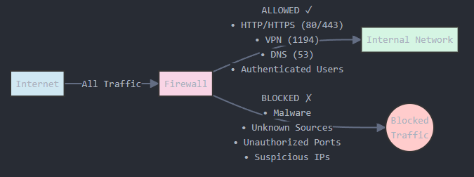
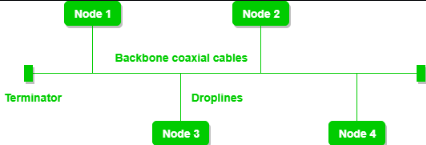
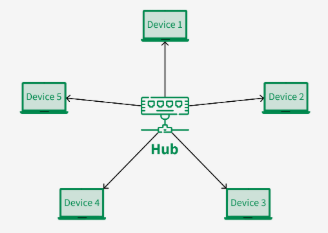
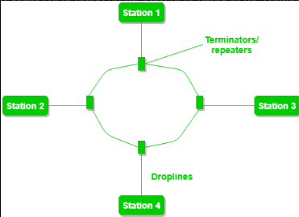
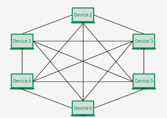
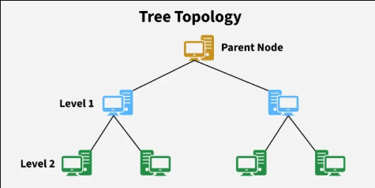
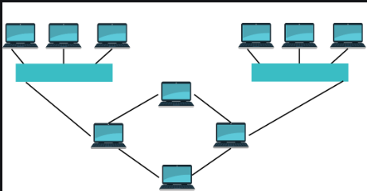

## 🔥 **Firewall**

---

## 🔹 1. FIREWALL — *Your Network's Security Guard*

---

### 🔧 What is a Firewall?

A **firewall** is a **security device or software** that:

* **Monitors** incoming and outgoing network traffic
* **Allows** or **blocks** data based on **predefined security rules**

Think of it as a **bouncer at a club** —
Only allows trusted people in and kicks out troublemakers.

---

### 🧱 Two Main Types of Firewalls

| Type                  | Description                                        | Example                             |
| --------------------- | -------------------------------------------------- | ----------------------------------- |
| **Hardware Firewall** | Physical device placed between network and gateway | Cisco ASA, FortiGate                |
| **Software Firewall** | Installed on a host machine or OS                  | Windows Defender Firewall, iptables |

---

### 🧠 Real-World Analogy:

* 🔐 *Firewall = Security Guard*
* 🚗 *Network Traffic = Cars at a checkpoint*
* ✅ *Allowed = Valid ticket (good traffic)*
* ❌ *Blocked = No ticket (malicious or unknown traffic)*

---

### 📚 How Firewalls Work (Simplified Steps)

1. A packet (piece of data) arrives at the firewall.
2. The firewall **checks rules** (based on IP, port, protocol, etc.).
3. If it **matches an “Allow” rule** → let it through.
4. If it **matches a “Deny” rule** → block it.

---

### 🧱 Common Firewall Rules:

| Rule Type    | Example                             |
| ------------ | ----------------------------------- |
| Allow HTTP   | Allow TCP traffic on port 80        |
| Block Telnet | Block TCP port 23 (unsafe)          |
| Allow SSH    | Allow TCP port 22 from specific IPs |

---

### 🔍 Where Firewalls Are Used in DevOps:

| Scenario                            | Purpose                                    |
| ----------------------------------- | ------------------------------------------ |
| AWS Security Groups                 | Act like virtual firewalls for EC2         |
| Kubernetes Network Policies         | Define firewall-like rules between pods    |
| Docker iptables                     | Firewall rules for container traffic       |
| Perimeter firewalls in data centers | Block malicious traffic at the entry point |

---

  

* Internet → Firewall → Internal Network
  Label the flow of traffic, what’s blocked vs allowed.

---

### 🔥 Types of Firewall Filtering Methods

| Filtering Type            | Description                                       |
| ------------------------- | ------------------------------------------------- |
| Packet Filtering          | Inspects headers of packets                       |
| Stateful Inspection       | Tracks ongoing connections                        |
| Application-layer (Proxy) | Understands and filters based on application data |
| NGFW (Next Gen Firewall)  | Combines all above + malware detection, etc.      |

---

### 🛡️ Firewall Zones

| Zone     | Purpose                                    |
| -------- | ------------------------------------------ |
| Internal | Trusted systems (e.g., internal servers)   |
| External | Untrusted (e.g., Internet)                 |
| DMZ      | Semi-trusted (e.g., public-facing servers) |

---

## 🔹 2. All Network Topologies (Physical & Logical)

---

### 🧭 What is a Network Topology?

A **network topology** is the **arrangement of computers, cables, switches, and routers** in a network.

We divide them into:

* **Physical Topology**: How devices are **physically connected**
* **Logical Topology**: How data **flows logically** between devices

---

## A. 🔧 Physical Topologies

These define the **actual layout of cables and devices**.

---

### 1. **Bus Topology**

* All devices connected to **one single backbone cable**
* Data flows in both directions

  

> 📝 **Diagram to Add**:
> Straight horizontal cable with devices (PCs) connected to it

---

### 2. **Star Topology**

* All devices connect to a **central switch/hub**
* Very common in modern LANs

✅ *Advantage*: If one cable fails, only that device is affected

  

---

### 3. **Ring Topology**

* Devices form a **closed loop**
* Data travels in one or both directions (depends on setup)

📉 *Disadvantage*: One failure can affect the entire loop

  

---

### 4. **Mesh Topology**

* **Every device** connects to **every other device**
* Offers full redundancy, best fault tolerance

📈 *Used in*: Data centers, critical systems

  

---

### 5. **Tree (Hierarchical) Topology**

* Combination of **Star + Bus**
* Good for structured networks (like enterprises)

  

---

### 6. **Hybrid Topology**

* Combines two or more topologies (e.g., Star + Mesh)

📈 *Used in*: Large modern networks for flexibility

  

---

## B. 🔄 Logical Topologies

Defines **how data flows**, regardless of physical layout.

---

| Logical Topology | Description                                            |
| ---------------- | ------------------------------------------------------ |
| Bus              | One device sends, others listen (e.g., Ethernet)       |
| Ring             | Data passed around a logical loop                      |
| Star             | Central device controls flow (e.g., Switch)            |
| Mesh             | Devices send directly to each other (P2P or Full Mesh) |

---

## 🧠 DevOps Perspective on Topologies:

| Task                      | Topology/Concept Involved               |
| ------------------------- | --------------------------------------- |
| Kubernetes Pod Networking | Logical Mesh                            |
| AWS VPC Design            | Star/Tree Hybrid                        |
| Data Center Networking    | Spine-Leaf (a specialized form of mesh) |
| Docker Overlay Network    | Logical Mesh topology                   |

---

## 🎯 Summary for Newbies

| Concept  | Easy Analogy                                                           |
| -------- | ---------------------------------------------------------------------- |
| Firewall | Security guard deciding who gets in/out                                |
| Topology | Map layout of roads (Physical = real roads, Logical = traffic pattern) |

---

