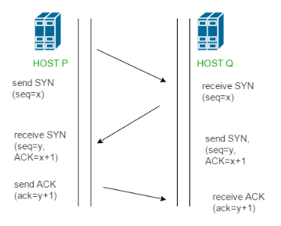
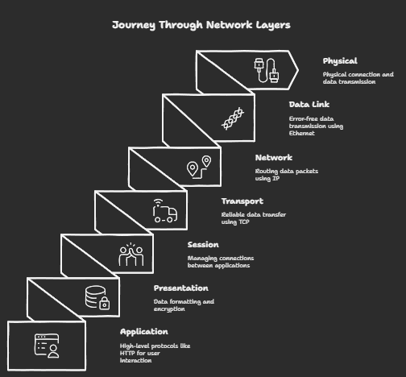
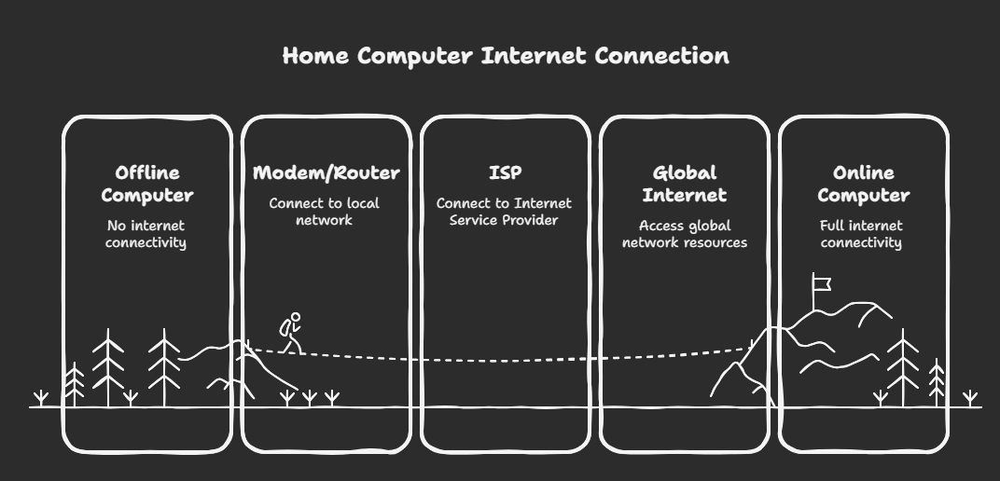

# Networking Fundamentals & Concepts

  

## 📚 Repository Overview

This repository contains comprehensive notes and reference materials on networking fundamentals, protocols, and infrastructure design. These materials are designed for IT professionals, network engineers, and students looking to strengthen their understanding of modern networking concepts.

## 🗂️ Contents

| Topic | Description |
|-------|-------------|
| [Internet & Networking Basics](01_Internet_&_Networking_Basics.md) | Core concepts of internet architecture and networking foundations |
| [TCP/IP Model](02_TCP_IP_Model.md) | The four layers of the TCP/IP networking model explained |
| [Network Devices](03_Network_Devices.md) | Overview of routers, switches, access points and other hardware |
| [IP Addressing](04_IP_Addressing.md) | IPv4/IPv6 addressing schemes, subnetting, and CIDR notation |
| [Network Protocols](05_Network_Protocols.md) | Common protocols including HTTP, DHCP, DNS, and more |
| [Network Security](06_Network_Security.md) | Security models, firewalls, encryption, and best practices |
| [Troubleshooting](07_Troubleshooting.md) | Common network issues and diagnostic procedures |
| [Network Services](08_Network_Services.md) | Overview of essential network services and configurations |
| [Network Design](09_Network_Design.md) | Best practices for designing secure, efficient networks |

## 🔍 Key Topics Covered

- Internet architecture and global connectivity
- The OSI and TCP/IP networking models
- Network hardware and infrastructure components
- IP addressing, subnetting and network segmentation
- Core network protocols and their functions
- Security fundamentals and best practices
- Troubleshooting methodology and tools
- Modern network design principles

  
  
<em>Network Data Flow Between Different Network Types</em>

## 🛠️ How to Use This Repository

These notes are organized by topic, with each Markdown file focusing on a specific aspect of networking. Each document includes:

- Concise explanations of key concepts
- Visual diagrams to illustrate complex ideas
- Real-world analogies to simplify technical concepts
- Key terminology and definitions

## 🎓 Educational Purpose

This material is designed as a reference and learning tool for:
- IT students and beginners in networking
- Professionals preparing for networking certifications
- IT staff who need to refresh their networking knowledge
- DevOps engineers working with network infrastructure

  
  
<em>Internet Global Architecture Overview</em>

## 📝 Notes on Content

The content focuses on practical understanding rather than theoretical concepts alone. Examples and diagrams are provided to illustrate how these networking principles apply in real-world scenarios.

---

  
Created and maintained with ❤️ by <a href="https://github.com/rohandeb2">Rohan Deb</a>

